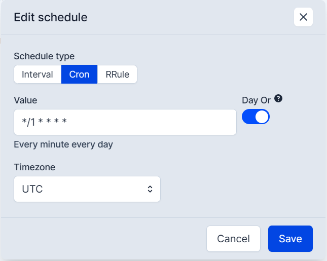
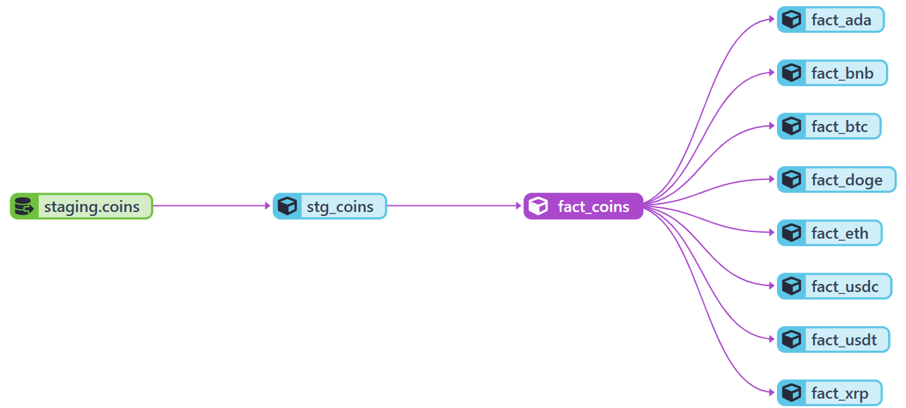
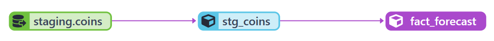
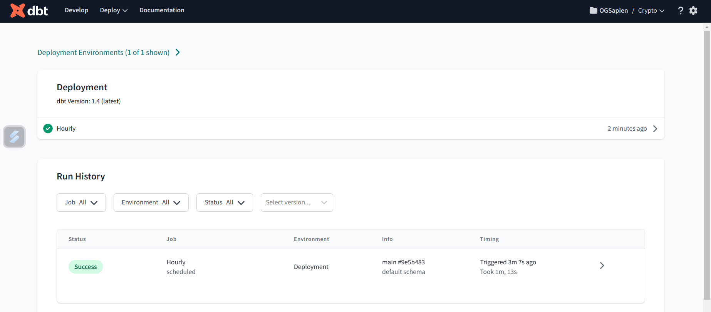
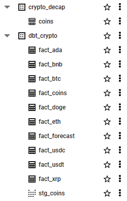
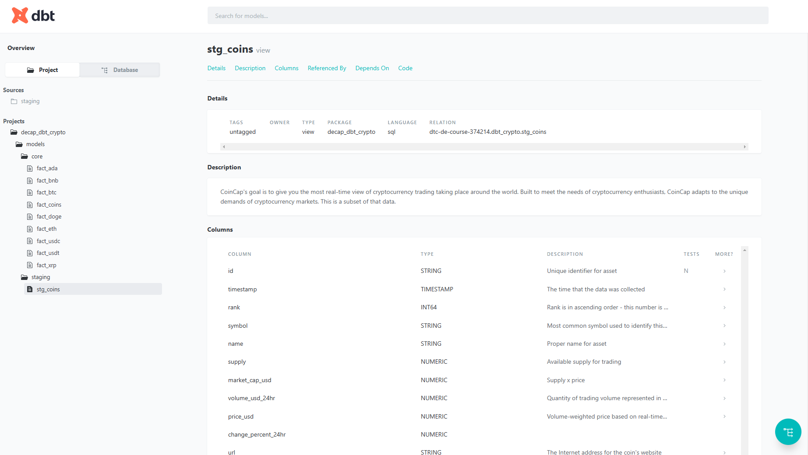
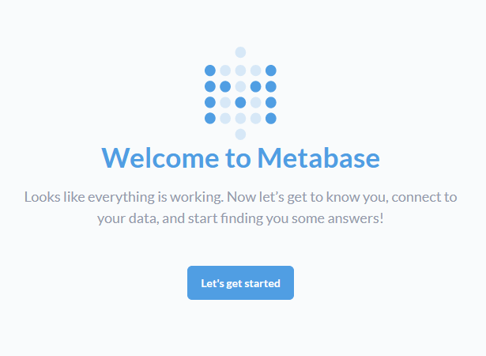
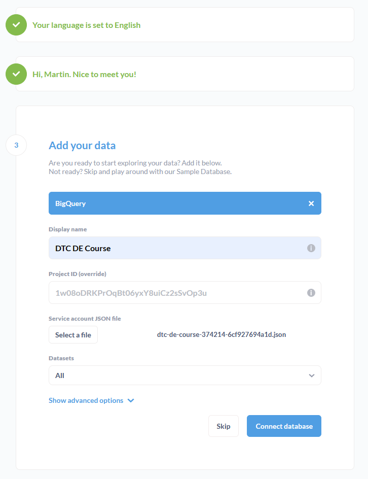
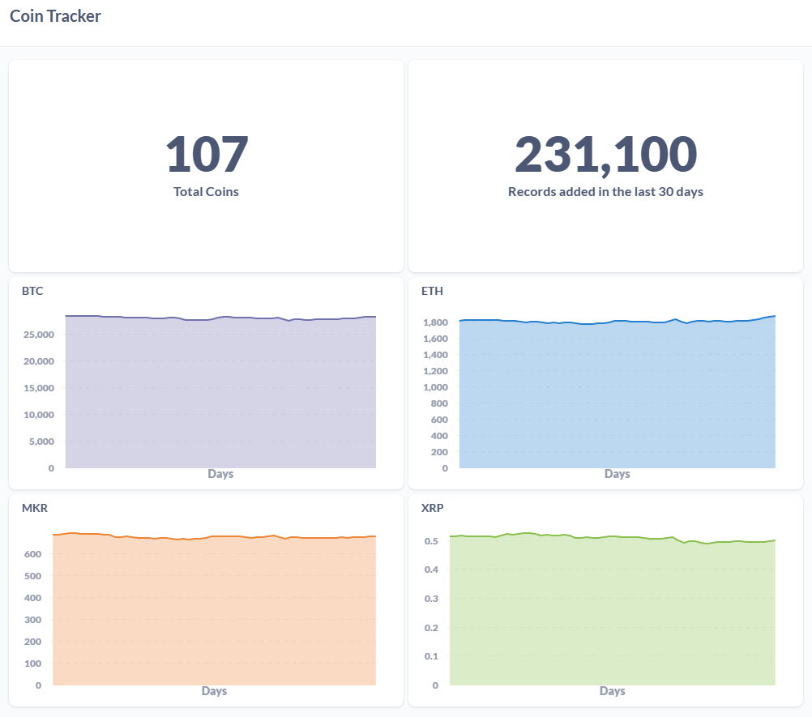
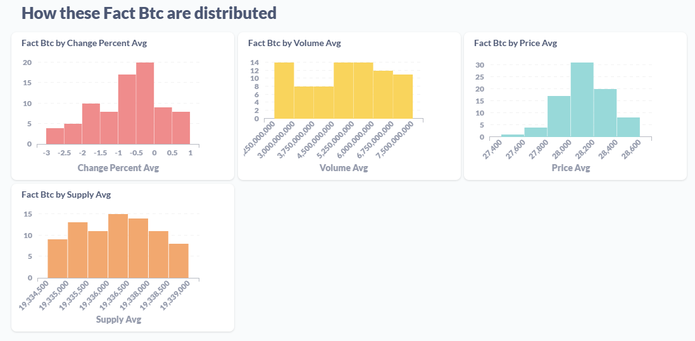

# Data Engineer Zoomcamp: Capstone Project (*de_capstone*)

> *This is an ETL pipeline created for my capstone project as part of the DE Zoomcamp course.*

![Python version][python-version]
![Latest version][latest-version]
[![GitHub issues][issues-image]][issues-url]
[![GitHub forks][fork-image]][fork-url]
[![GitHub Stars][stars-image]][stars-url]
[![License][license-image]][license-url]

NOTE: This project template was generated with [Cookiecutter](https://github.com/audreyr/cookiecutter) using my [toepack](https://github.com/clamytoe/toepack) project template.

For this project I decided to go with a streaming datasource. With the goal of capturing near real-time crypto currency data and analyze it to see how it fluctuates throughout the day. Here are some details about the data:

* source: [coincap.io](https://coincap.io/)
* coins: **Top 100** ranking coins
* interval: Captured **every minute**
* storage: Google **BigQuery**
* partition: By day using **timestamp** field
* cluster: By **id** field

While trying to figure out how to approach this problem, I discovered that I could skip uploading the dataset files into Google Cloud Storage and add the rows directly into my database table on BigQuery with the use of `bigquery_insert_stream` from the `bigquery` module found in the `prefect_gcp` package.

Although it took me a while to get it to work right, the approach is relatively straight forward... well once you know how to do it.

> **NOTE:** I'd like to thank [coincap](https://coincap.io/) for providing the service for free! They are pretty generous with their free tier, which I greatly appreciate.

## Initial setup

```zsh
cd Projects
git clone https://github.com/clamytoe/de_capstone.git
cd de_capstone
```

### Anaconda setup

If you are an Anaconda user, this command will get you up to speed with the base installation.

```zsh
conda env create
conda activate de_capstone
```

### Regular Python setup

If you are just using normal Python, this will get you ready, but I highly recommend that you do this in a virtual environment.
There are many ways to do this, the simplest using *venv*.

```zsh
python3 -m venv venv
source venv/bin/activate
pip install -r requirements.txt
```

## Start prefect server

Start the Orion server to get started.

*terminal 1*:

```bash
prefect server start

 ___ ___ ___ ___ ___ ___ _____
| _ \ _ \ __| __| __/ __|_   _|
|  _/   / _|| _|| _| (__  | |
|_| |_|_\___|_| |___\___| |_|

Configure Prefect to communicate with the server with:

    prefect config set PREFECT_API_URL=http://127.0.0.1:4200/api

View the API reference documentation at http://127.0.0.1:4200/docs

Check out the dashboard at http://127.0.0.1:4200
```

Open up your browser to [http://127.0.0.1:4200](http://127.0.0.1:4200) to get started.

## Creating the required Blocks

For this simple deployment only the GCP Credentials block is needed. When you generate your API key on Google, simple paste its contents into the *Service Account Info* text field.


## Notifications

This step is optional, but I setup a Slack notification for any failed runs.


## Deployment

To create the deployment, run the following command:

```bash
prefect deployment build flows/bq_flow.py:etl_api_to_bq -n "Decap BQ ETL"
```

It will generate the `etl_api_to_bq-deployment.yaml` configuration file. You will need to fill in the *parameters* field.

For this deployment, only the `url` is required.

```yaml
parameters: { "url": "https://api.coincap.io/v2/assets" }
```

Once the parameters field is set, you can apply the deployment:

```bash
prefect deployment apply etl_api_to_bq-deployment.yaml
```

You can confirm it's creation in Orion:


## Schedule

Coincap's free tier allows up to 200 calls per hour, so I decided to stay way below that and keep it at once per minute. For this project I decided to go with the Cron scheduler:



Once set, your deployment details should look something like this:


## Start the data ETL pipeline

As soon as the schedule is set, it will start to schedule the deployments and to kick it off, all you have to do is start the default woker agent.

*terminal 2*:

```bash
prefect agent start -q 'default'
Starting v2.8.6 agent connected to http://127.0.0.1:4200/api...

  ___ ___ ___ ___ ___ ___ _____     _   ___ ___ _  _ _____
 | _ \ _ \ __| __| __/ __|_   _|   /_\ / __| __| \| |_   _|
 |  _/   / _|| _|| _| (__  | |    / _ \ (_ | _|| .` | | |
 |_| |_|_\___|_| |___\___| |_|   /_/ \_\___|___|_|\_| |_|


Agent started! Looking for work from queue(s): default...
06:19:55.567 | INFO    | prefect.agent - Submitting flow run '0b89d4f7-f289-4ff0-bb69-2e5a1b486e33'
```

As soon as the agent is started it will start kicking off your flows.

## Flows

The script runs two flows. The first is the ETL pipeline process, with inserting the data into BigQuery being its own independent flow.

*etl:*


*bq-insert:*


After having run the pipeline for over the weekend, it looked like this:


## Google BigQuery

Head on over to BigQuery to verify that your data is being uploaded.


## Partition and Cluster table

I wanted to partition my table by the day using the `timestamp` and cluster it by the `id` field. In order to do that, I first stopped prefect so that it would not keep pushing anymore data.

I then used the following SQL commands in order to prepare the table:

```sql
-- Create a new partitioned table
CREATE TABLE dtc-de-course-374214.crypto_decap.crypto_coins
PARTITION BY DATE(timestamp)
CLUSTER BY id
AS SELECT *
FROM dtc-de-course-374214.crypto_decap.coins
WHERE 1 = 0; -- this will create an empty table with the same schema as coins

-- Copy data from the original table to the new partitioned table
INSERT INTO dtc-de-course-374214.crypto_decap.crypto_coins
SELECT *
FROM dtc-de-course-374214.crypto_decap.coins;

-- Verify that the data has been successfully copied to the new partitioned table
SELECT COUNT(*) FROM dtc-de-course-374214.crypto_decap.crypto_coins;

-- Delete the original table
DROP TABLE dtc-de-course-374214.crypto_decap.coins;

-- Rename the new table to the old name
ALTER TABLE dtc-de-course-374214.crypto_decap.crypto_coins RENAME TO coins;
```

> **NOTE:** The project name is specific to my account, yours will be different.

Once you have created the new table, you can verify that it is partitioned and clusted by looking at its details:


## dbt

Now that the data has been collected for a while, it's time to start creating some tables from it. For this I used [dbt](https://www.getdbt.com/) and my repo for that portion can be found here: [dbt_crypto](https://github.com/clamytoe/dbt_crypto)

### Local dbt setup

I created a local deployment of dbt as a Docker container. If you would like to see how that is done, head on over to my repo [dbt_crypto_local](https://github.com/clamytoe/dbt_crypto_local)

### dbt cloud

The following was created on the dbt cloud platform [dbt cloud](https://cloud.getdbt.com/).

The line graph for this portion of the project looks like this:





I've created a deployment for the dbt project and scheduled it to run once every hour.



### Results from dbt

Here are the final view and tables after running dbt on BigQuery:



### Documentation

Enabled documentation and autogenerated docs.



## Dashboard

To generate the dashboard I used [Metabase](https://www.metabase.com/). Their interface is slick and easy to use. You can run a local containerized version with the following command:

```bash
docker run -d -p 3000:3000 metabase/metabase
6e79400f5d3b8836f120e774f40a0e7206dae2c394785fcaf9d5b8fdd08150dd
```

The interface will now be available at: [loccalhost:3000](http://localhost:3000)



You will have to configure it to connect to your account on whichever cloud platform you are using.



Once you have successfully connected, you can start playing around creating dashboards.


Once more data has been collected, more meaningful charts can be created.



Bitcoin Distribution



## License

Distributed under the terms of the [MIT](https://opensource.org/licenses/MIT) license, "de_capstone" is free and open source software.

## Issues

If you encounter any problems, please [file an issue](https://github.com/clamytoe/toepack/issues) along with a detailed description.

[python-version]:https://img.shields.io/badge/python-3.10.9-brightgreen.svg
[latest-version]:https://img.shields.io/badge/version-0.1.0-blue.svg
[issues-image]:https://img.shields.io/github/issues/clamytoe/de_capstone.svg
[issues-url]:https://github.com/clamytoe/de_capstone/issues
[fork-image]:https://img.shields.io/github/forks/clamytoe/de_capstone.svg
[fork-url]:https://github.com/clamytoe/de_capstone/network
[stars-image]:https://img.shields.io/github/stars/clamytoe/de_capstone.svg
[stars-url]:https://github.com/clamytoe/de_capstone/stargazers
[license-image]:https://img.shields.io/github/license/clamytoe/de_capstone.svg
[license-url]:https://github.com/clamytoe/de_capstone/blob/master/LICENSE
